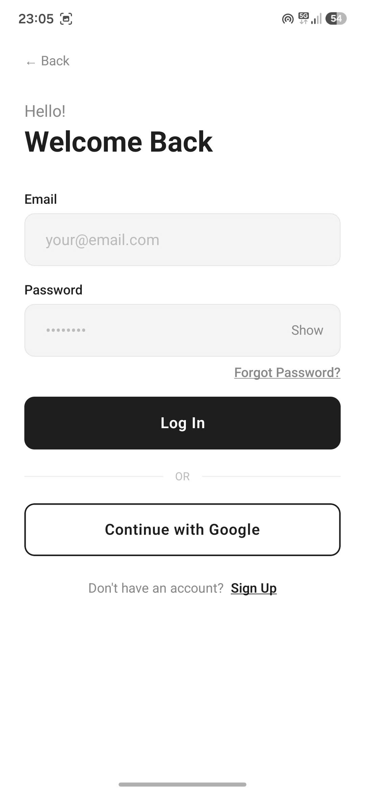
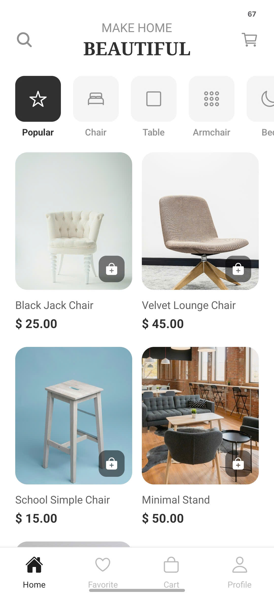
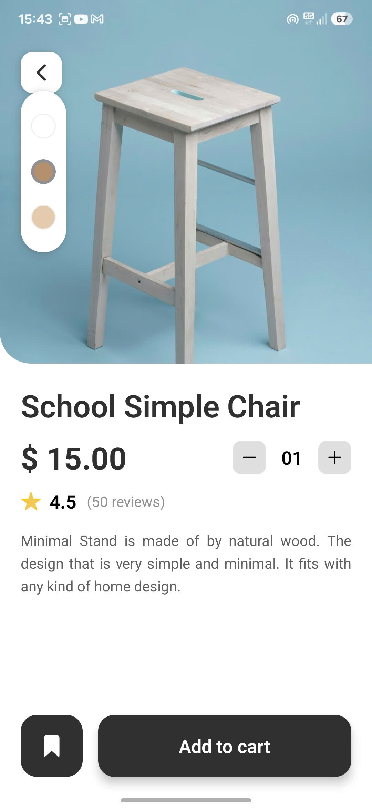
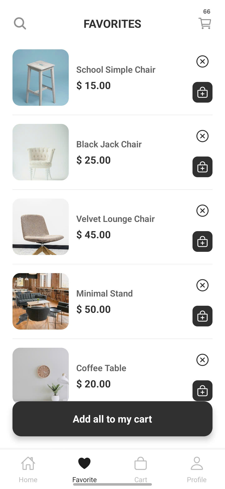
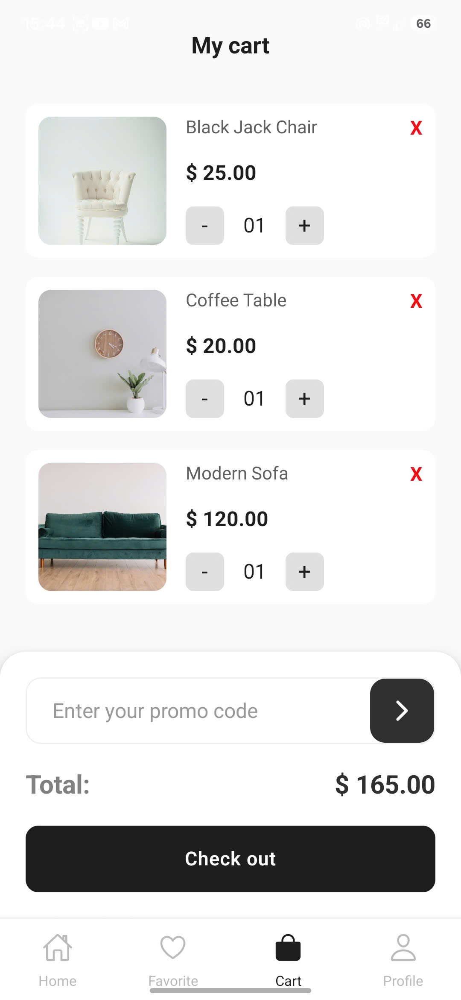
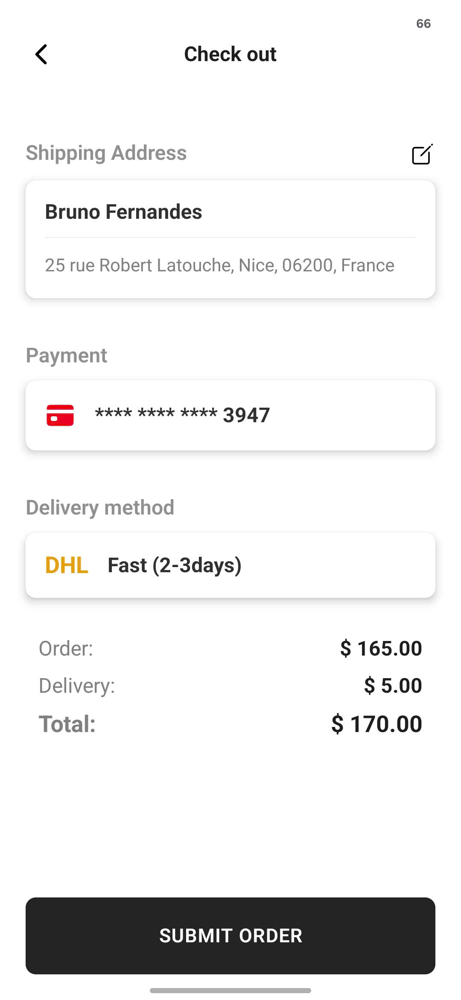
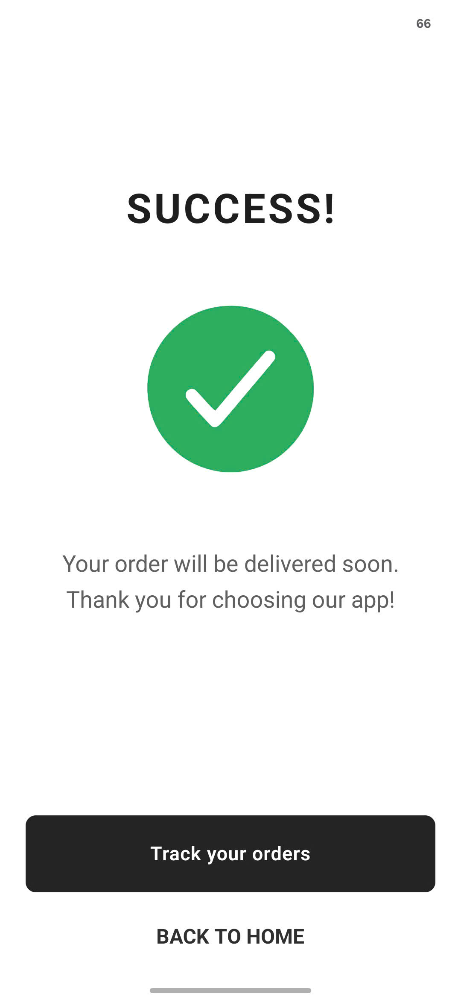
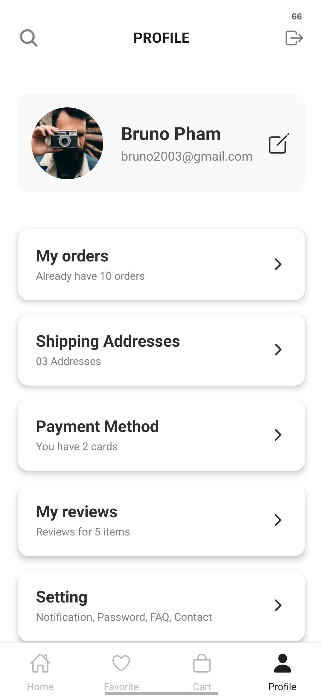

## 📌 Tên đề tài

**Ứng dụng thương mại điện tử nội thất — FurniShop Mobile App**

---

## 🎯 Giới thiệu hệ thống

**FurniShop** là ứng dụng di động thương mại điện tử chuyên về nội thất, xây dựng bằng **React Native (Expo)** và **TypeScript**. Ứng dụng cung cấp trải nghiệm mua sắm nội thất trực quan, hiện đại với giao diện tối giản được thiết kế theo Figma.

### ✨ Tính năng chính

| Module           | Màn hình                       | Mô tả                           |
| ---------------- | ------------------------------ | ------------------------------- |
| 🔐 **Auth**      | Boarding, Login, Sign Up       | Xác thực người dùng, onboarding |
| 🏠 **Discovery** | Home, Product Detail, Favorite | Khám phá & tìm kiếm sản phẩm    |
| 🛒 **Commerce**  | Cart, Checkout, Congrats       | Đặt hàng & thanh toán           |
| 👤 **Profile**   | Profile                        | Quản lý tài khoản & đơn hàng    |

---

## 👥 Danh sách thành viên

| STT | Họ và Tên                   |     MSSV      | Vai trò                        |
| :-: | --------------------------- | :-----------: | ------------------------------ |
|  1  | [Nguyễn Tùng Lâm] — **Lâm** | [23810310135] | Dev A — Foundation & Auth Lead |
|  2  | [Trần Minh Huy] — **Huy**   | [23810310125] | Dev B — Product Discovery      |
|  3  | [Trần Khắc Lộc] — **Lộc**   | [23810310153] | Dev C — Commerce & Profile     |

---

## 📋 Phân công nhiệm vụ chi tiết

---

### 👨‍💻 Dev Lâm | Foundation + Auth (3 màn)

#### 🔧 Setup dự án

- Khởi tạo project Expo + TypeScript
- Cấu hình `tsconfig.json` với path aliases (`@theme/*`, `@components/*`, `@screens/*`, `@store/*`)
- Cài đặt và cấu hình toàn bộ dependencies

#### 🎨 Theme System

| File                      | Nội dung                                                           |
| ------------------------- | ------------------------------------------------------------------ |
| `src/theme/colors.ts`     | Bảng màu toàn cục (primary `#1E1E1E`, backgrounds, text, error...) |
| `src/theme/spacing.ts`    | Hệ thống spacing 4px grid, layout constants, `SCREEN_W/H`          |
| `src/theme/typography.ts` | Font family, size, weight, line-height, pre-built text styles      |

#### 🧩 Shared Components

| Component    | Mô tả                                                                   |
| ------------ | ----------------------------------------------------------------------- |
| `AppText`    | Component chữ tái sử dụng, nhận `variant` từ typography                 |
| `AppButton`  | Nút bấm 3 biến thể: `primary` / `outline` / `ghost`, có loading spinner |
| `AppInput`   | Ô nhập liệu với label, error message, password toggle                   |
| `SafeScreen` | Wrapper an toàn: scrollable + keyboard avoid                            |

#### 🗺️ Navigation

- Cấu hình `RootNavigator` — phân nhánh Auth Stack / Main Stack theo `isAuthenticated`
- Định nghĩa kiểu TypeScript cho toàn bộ navigation (`navigation/types.ts`)

#### 📱 Màn hình (3 màn)

**1. Boarding Screen**

- Full-screen hero image (`assets/boarding.jpg`) với `ImageBackground`
- Gradient overlay tối dần từ trên xuống dưới (`LinearGradient`)
- Tagline "FURNITURE SHOP", headline "Make Your Home Beautiful"
- Nút **Get Started** → điều hướng sang Login
- Link **Sign up** với `hitSlop` mở rộng vùng bấm

**2. Login Screen**

- Greeting "Hello! Welcome Back"
- Form: `email` + `password` với validation (format email, min 6 ký tự)
- Link "Forgot Password?" (placeholder)
- Nút **Log In** → `navigation.replace('Main')` sau khi xác thực thành công
- Divider OR + Social login placeholder (Google)
- Footer "Don't have an account? Sign Up"

**3. Sign Up Screen**

- Form 4 trường: `Full Name`, `Email`, `Password`, `Confirm Password`
- Validation: required, email format, min 6 ký tự, khớp mật khẩu
- Terms of Service + Privacy Policy links
- Nút **Sign Up** → điều hướng vào Main
- Footer "Already have an account? Log In"

#### 🗄️ State Management

- `src/store/authStore.ts` — Zustand store: `token`, `user`, `isAuthenticated`, `login()`, `logout()`

---

### 👨‍💻 Dev Huy | Product Discovery (3 màn)

#### 📱 Màn hình (3 màn)

**1. Home Screen**

- Search bar tìm kiếm sản phẩm
- Horizontal category scroll — `CategoryTab` component
- Banner / featured section
- Product grid — `FlatList` 2 cột dùng `ProductCard`
- Bottom Tab Navigation

**2. Product Detail Screen**

- Tên "Minimal Stand", giá "$50", rating sao
- `ImageSlider` — carousel ảnh sản phẩm (vuốt ngang)
- `ColorSelector` — chọn màu sản phẩm
- `QuantityStepper` — tăng/giảm số lượng
- Mô tả sản phẩm, đánh giá
- Nút **Add to Cart** → cập nhật `cartStore`

**3. Favorite Screen — "Standbox"**

- `FlatList` ngang — `ProductCard` dạng horizontal
- Swipe-to-remove xóa khỏi danh sách yêu thích
- Nút **Add all to my cart**

#### 🧩 Components cần xây dựng

| Component         | Mô tả                                        |
| ----------------- | -------------------------------------------- |
| `ProductCard`     | Card sản phẩm: ảnh, tên, giá, icon yêu thích |
| `ImageSlider`     | Carousel ảnh sản phẩm với pagination dots    |
| `CategoryTab`     | Tab scroll ngang để lọc theo danh mục        |
| `ColorSelector`   | Row chọn màu dạng hình tròn                  |
| `QuantityStepper` | Nút tăng/giảm số lượng                       |

---

### 👨‍💻 Dev Lộc | Commerce + Profile (4 màn)

#### 📱 Màn hình (4 màn)

**1. Cart Screen — "My Cart"**

- Danh sách `CartItem`: ảnh + tên + giá + quantity stepper
- Price summary: subtotal, delivery fee, total
- Nút **Check Out** → điều hướng sang Checkout

**2. Checkout Screen**

- `AddressCard` — chọn địa chỉ giao hàng
- `PaymentOption` — radio button: Visa hoặc COD
- Breakdown giá: sản phẩm + phí giao hàng
- Nút **SUBMIT ORDER** → xử lý đặt hàng → sang Congrats

**3. Congrats Screen — "SUCCESS!"**

- **Lottie animation** / icon check-mark có hiệu ứng
- Text xác nhận đặt hàng thành công
- Nút **Track your order** → điều hướng sang Profile (My Orders)
- Nút **Back to Home** → về HomeScreen

**4. Profile Screen — "Bruno Pham"**

- Avatar tròn + tên + email
- Menu list với icon:
  - My Orders
  - Shipping Addresses
  - Payment Method
  - My Reviews
  - Setting
- Điều hướng vào từng sub-screen tương ứng

#### 🗄️ State Management

- `src/store/cartStore.ts` — Zustand: danh sách items, `addItem()`, `removeItem()`, `updateQty()`, `clearCart()`, tính tổng tiền

---

## 🛠️ Công nghệ sử dụng

### Core Framework

| Công nghệ                                     | Phiên bản | Mục đích                        |
| --------------------------------------------- | :-------: | ------------------------------- |
| [React Native](https://reactnative.dev/)      |   0.74+   | Framework mobile cross-platform |
| [Expo](https://expo.dev/)                     |    51+    | Toolchain, SDK, build system    |
| [TypeScript](https://www.typescriptlang.org/) |    5.x    | Static typing, type safety      |

### Navigation

| Thư viện                         | Mục đích                      |
| -------------------------------- | ----------------------------- |
| `@react-navigation/native`       | Navigation core               |
| `@react-navigation/native-stack` | Stack navigator (Auth / Main) |
| `@react-navigation/bottom-tabs`  | Bottom tab bar (Main flow)    |
| `react-native-gesture-handler`   | Hỗ trợ gesture (swipe...)     |
| `react-native-safe-area-context` | Tránh notch, home indicator   |
| `react-native-screens`           | Tối ưu hiệu năng navigation   |

### UI & Animation

| Thư viện               | Mục đích                               |
| ---------------------- | -------------------------------------- |
| `expo-linear-gradient` | Gradient overlay màn hình Boarding     |
| `expo-status-bar`      | Điều khiển thanh status bar            |
| `lottie-react-native`  | Animation "SUCCESS!" màn hình Congrats |

### State Management & Storage

| Thư viện            | Mục đích                               |
| ------------------- | -------------------------------------- |
| `zustand`           | Global state: `authStore`, `cartStore` |
| `expo-secure-store` | Lưu token JWT bảo mật trên thiết bị    |

---

## ⚙️ Hướng dẫn cài đặt

### Yêu cầu hệ thống

```
Node.js  >= 18.x
npm      >= 9.x  (hoặc yarn >= 1.22)
Expo Go  (app trên điện thoại) — để test nhanh không cần emulator
```

**Tùy chọn để chạy trên emulator:**

- **Android:** Android Studio + AVD Manager
- **iOS:** Xcode 15+ _(chỉ trên macOS)_

---

### Bước 1 — Clone repository

```bash
git clone https://github.com/tunglam2803/furniture-shop
cd furnishop-shop

```

### Bước 2 — Cài đặt dependencies

```bash
npm install

### Kiểm tra assets

Đảm bảo các file sau tồn tại:

```

assets/
boarding.jpg ← ảnh hero màn hình Boarding
icon.png ← icon app
splash.png ← splash screen

````

---

## 🚀 Hướng dẫn chạy project

### ▶️ Chạy với Expo Go *(khuyến nghị — nhanh nhất)*

```bash
npx expo start
````

Sau đó:

- 📱 **Điện thoại thật:** Mở app **Expo Go** → quét mã QR hiển thị trên terminal
- 🖥️ **Android Emulator:** Nhấn phím `a` trong terminal
- 🖥️ **iOS Simulator:** Nhấn phím `i` trong terminal _(chỉ macOS)_

## 🔑 Tài khoản demo

## | User thường | `test@gmail.com` | `123456` |

## 🖼️ Hình ảnh minh họa hệ thống

### Auth Flow

|                  Boarding                  |                Login                 |                Sign Up                 |
| :----------------------------------------: | :----------------------------------: | :------------------------------------: |
|  |  |  |

### Product Discovery

|                Home                |              Product Detail              |                  Favorite                  |
| :--------------------------------: | :--------------------------------------: | :----------------------------------------: |
|  |  |  |

### Commerce

|                Cart                |                  Checkout                  |                  Congrats                  |
| :--------------------------------: | :----------------------------------------: | :----------------------------------------: |
|  |  |  |

### Profile

|                 Profile                  |
| :--------------------------------------: |
|  |

## 🎬 Video Demo

▶️ **Link video demo:** [Xem tại đây »](https://www.youtube.com/shorts/PN0pSfneq5E)

## 📁 Cấu trúc thư mục

```
furnishop-mobile/
├── assets/                        # Ảnh, icons, fonts
│   └── boarding.jpg
├── src/
│   ├── components/
│   │   └── shared/                # AppText, AppButton, AppInput, SafeScreen
│   ├── navigation/
│   │   ├── RootNavigator.tsx      # Auth Stack ↔ Main Stack
│   │   └── types.ts               # TypeScript navigation types
│   ├── screens/
│   │   ├── auth/                  # Boarding, Login, Signup          [Dev Lâm]
│   │   ├── home/                  # Home, ProductDetail              [Dev Huy]
│   │   ├── favorite/              # Favorite                         [Dev Huy]
│   │   ├── cart/                  # Cart, Checkout, Congrats         [Dev Lộc]
│   │   └── profile/               # Profile                          [Dev Lộc]
│   ├── store/
│   │   ├── authStore.ts           # Auth state (Zustand)             [Dev Lâm]
│   │   └── cartStore.ts           # Cart state (Zustand)             [Dev Lộc]
│   └── theme/
│       ├── colors.ts              # Bảng màu                         [Dev Lâm]
│       ├── spacing.ts             # Spacing, layout constants         [Dev Lâm]
│       ├── typography.ts          # Font styles                       [Dev Lâm]
│       └── index.ts               # Re-export
├── App.tsx                        # Entry point
├── tsconfig.json                  # TypeScript + path aliases
├── app.json                       # Expo config
└── package.json
```
